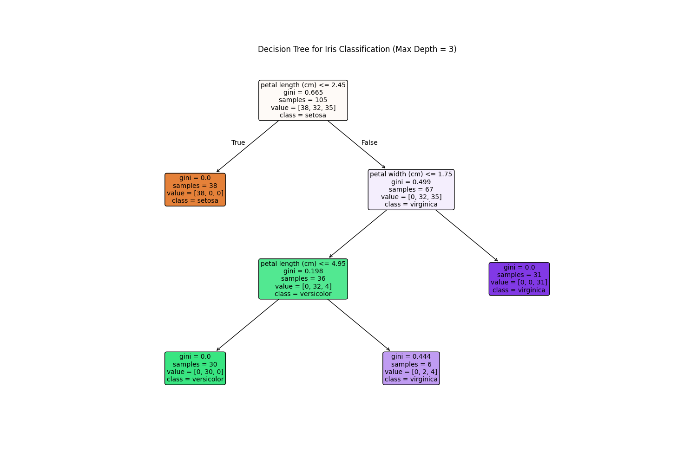
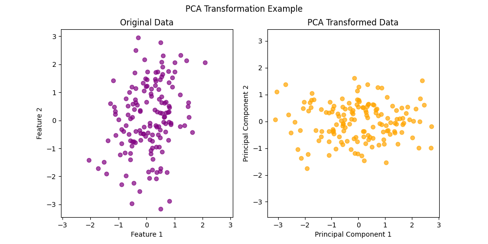

# Machine Learning Foundations

Comprehensive collection of Machine Learning algorithms, clustering techniques, dimensionality reduction methods, and statistical concepts implemented using Python and Scikit-learn.

---

## Repository Overview

This repository contains implementations of core Machine Learning concepts organized into structured categories including supervised learning, unsupervised learning, dimensionality reduction, and optimization/statistical methods.

The goal of this repository is to build strong ML foundations through practical implementations and visualizations.

---

# Topics Covered

## Supervised Learning
- Linear Regression
- Logistic Regression
- Decision Trees
- Random Forest
- Naive Bayes
- Gradient Boosting
- Ensemble Learning

---

## Unsupervised Learning
- K-Means Clustering
- DBSCAN
- Hierarchical Clustering

---

## Dimensionality Reduction
- PCA (Principal Component Analysis)
- LDA (Linear Discriminant Analysis)
- SVD (Singular Value Decomposition)

---

## Optimization & Statistics
- Gradient Descent
- Confusion Matrix
- Hypothesis Testing

---

# Repository Structure

```text
machine-learning-foundations/
│
├── supervised-learning/
├── unsupervised-learning/
├── dimensionality-reduction/
├── optimization-and-math/
│
├── README.md
├── requirements.txt
└── .gitignore
```

---

# Technologies Used

- Python
- NumPy
- Matplotlib
- Scikit-learn
- SciPy
- Seaborn

---

# Features

- Structured folder organization
- Experiment-wise documentation
- Visualization outputs
- Evaluation metrics
- Beginner-friendly implementations
- Consistent project structure

---

# Sample Outputs

## Decision Tree Visualization



---

## K-Means Clustering


---

## PCA Visualization



---

# What I Learned

- Supervised and unsupervised learning workflows
- Model evaluation techniques
- Clustering algorithms
- Dimensionality reduction methods
- Optimization concepts
- Statistical analysis fundamentals

---

# How to Run

Example:

```bash
python main1.py
```

---

# Author

Rudraksh Mehta
