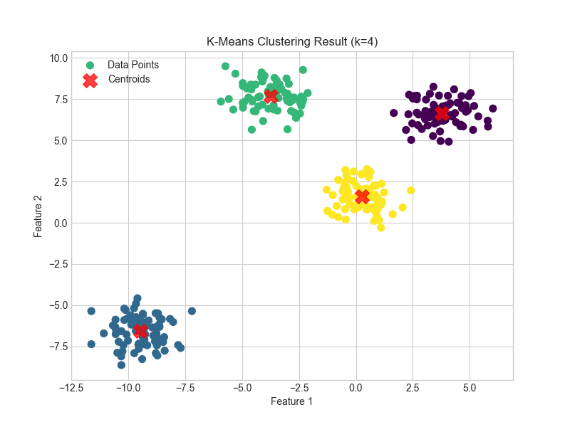
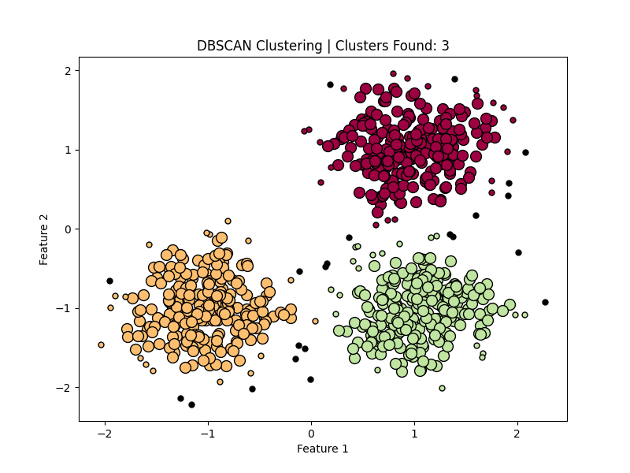
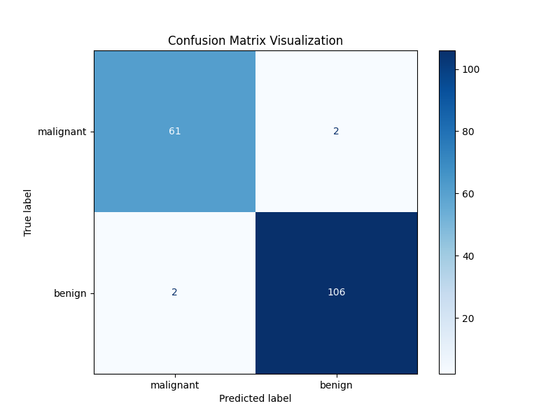

# Machine Learning Foundations

Comprehensive collection of Machine Learning algorithms, clustering techniques, dimensionality reduction methods, and statistical concepts implemented using Python and Scikit-learn.

---

## Purpose of This Repository

This repository was created to strengthen my understanding of core Machine Learning concepts through hands-on implementation, experimentation, visualization, and evaluation.

The project is organized into structured categories covering supervised learning, unsupervised learning, dimensionality reduction, optimization, and statistical analysis.

---

# Sample Outputs

## K-Means Clustering



---

## DBSCAN Clustering



---

## Confusion Matrix Visualization



---

# Topics Covered

## Supervised Learning
- Linear Regression
- Logistic Regression
- Decision Trees
- Random Forest
- Naive Bayes
- Gradient Boosting
- Ensemble Learning

---

## Unsupervised Learning
- K-Means Clustering
- DBSCAN
- Hierarchical Clustering

---

## Dimensionality Reduction
- PCA (Principal Component Analysis)
- LDA (Linear Discriminant Analysis)
- SVD (Singular Value Decomposition)

---

## Optimization & Statistics
- Gradient Descent
- Confusion Matrix
- Hypothesis Testing

---

# Repository Structure

```text
machine-learning-foundations/
│
├── supervised-learning/
├── unsupervised-learning/
├── dimensionality-reduction/
├── optimization-and-math/
│
├── README.md
├── requirements.txt
└── .gitignore
```

---

# Quick Navigation

- [Supervised Learning](supervised-learning)
- [Unsupervised Learning](unsupervised-learning)
- [Dimensionality Reduction](dimensionality-reduction)
- [Optimization and Statistics](optimization-and-math)

---

# Technologies Used

- Python
- NumPy
- Matplotlib
- Scikit-learn
- SciPy
- Seaborn

---

# Key Highlights

- 16 Machine Learning experiments
- Structured folder organization
- Visualization-based outputs
- Experiment-wise documentation
- Supervised and unsupervised learning implementations
- Dimensionality reduction techniques
- Statistical analysis and optimization methods

---

# What I Learned

- Machine Learning workflows
- Data preprocessing techniques
- Model evaluation methods
- Clustering algorithms
- Dimensionality reduction concepts
- Optimization and statistical analysis
- Visualization and documentation practices

---

# Installation

```bash
pip install -r requirements.txt
```

---

# Running Experiments

Example:

```bash
cd supervised-learning/01-linear-regression
python main1.py
```

---

# Author

Rudraksh Mehta
